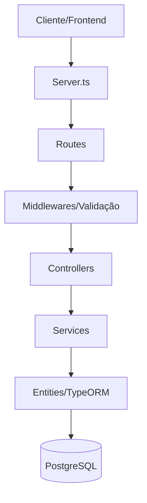

# Documento de Solução - API Mundo Geek

Esta API foi desenvolvida como parte da atividade prática (Hands-on) para o Gerenciamento de Loja.

## 1. Arquitetura da Solução

A API segue uma arquitetura modular baseada em camadas, facilitando a manutenção e escalabilidade:



- **Routes**: Define os endpoints da aplicação.
- **Controllers**: Gerencia a entrada/saída (req/res) e chama os serviços.
- **Services**: Contém a lógica de negócio e orquestração.
- **Entities**: Representa as tabelas do banco de dados via TypeORM.
- **Validates**: Esquemas de validação de dados utilizando Zod.

## 2. Decisões de Design

- **TypeORM**: Escolhido para facilitar a manipulação do banco de dados PostgreSQL através de objetos TypeScript.
- **Zod**: Utilizado para garantir que os dados de entrada estejam no formato correto antes de chegarem à camada de serviço.
- **Relacionamento 1:N**: Uma Categoria pode ter múltiplos produtos, implementado através de `@OneToMany` e `@ManyToOne`.
- **Soft Delete/Timestamps**: Incluídos campos de `dataCriacao` e `dataAtualizacao` em todas as entidades.

## 3. Divisão de Responsabilidades

- **Separação de Camadas**: A lógica de banco de dados não fica no controller; ela é delegada para o Service.
- **Validação Isolada**: Os schemas de validação ficam em arquivos próprios, mantendo as rotas limpas.
- **Tratamento de Erros Centralizado**: Um middleware global captura erros e envia respostas padronizadas ao cliente.

## 4. Como Rodar o Projeto Localmente

### Pré-requisitos
- Node.js instalado
- Docker Desktop (para o PostgreSQL)

### Passo a Passo
1. **Clone o repositório**:
   ```bash
   git clone https://github.com/patrese-ebs/mundo-geek-api.git
   cd mundo-geek-api
   ```

2. **Instale as dependências**:
   ```bash
   npm install
   ```

3. **Suba o Banco de Dados (Docker)**:
   ```bash
   docker run --name pg-mundo-geek -e POSTGRES_PASSWORD=123 -e POSTGRES_DB=mundo_geek -p 5432:5432 -d postgres
   ```

4. **Configure o `.env`**:
   Crie um arquivo `.env` na raiz:
   ```env
   DB_HOST=localhost
   DB_PORT=5432
   DB_USER=postgres
   DB_PASSWORD=123
   DB_NAME=mundo_geek
   ```

5. **Inicie a API**:
   ```bash
   npm run dev
   ```

6. **Acesse o Frontend**:
   Abra [http://localhost:3000](http://localhost:3000) no navegador.
